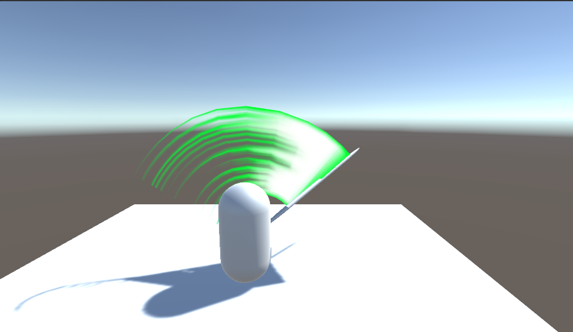
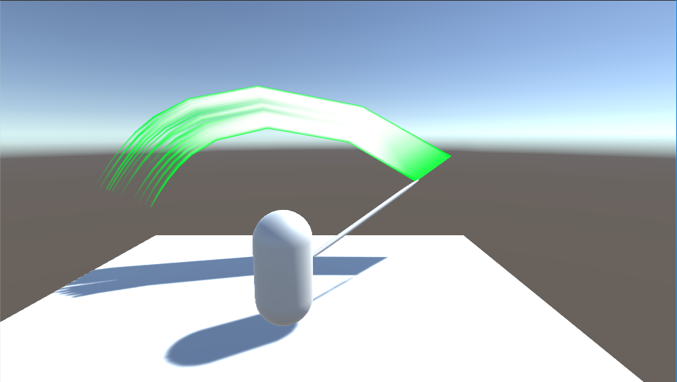

# 軌跡表現

# 経過画像
## トレイルレンダラー
トレイルレンダラーで剣をかっこよく振り回そう 
 

## 自作トレイル
自分で軌跡を描画しよう 
 

スプライン曲線を使ってなめらかにしよう 
 

空間を歪めてみよう 
 

オレオレ軌跡を作ろう 
 

# 資料

[本日の資料](%5B%E5%85%AC%E9%96%8B%E7%94%A8%5D%202019_%E3%83%97%E3%83%AD%E3%82%B0%E3%83%A9%E3%83%A0%E3%83%AF%E3%83%BC%E3%82%AF%E3%82%B7%E3%83%A7%E3%83%83%E3%83%97IV%20(9)%20%20%E3%83%88%E3%83%AC%E3%82%A4%E3%83%AB.pdf)

# 補足
授業で作成したプロジェクトファイルをforkしたプロジェクトに上げてください。

1_trail_renderer, 2_selfフォルダにプロジェクトのファイルを入れてください。
.gitignore を反映させて、無駄なファイルをアップロードしないようにしてください。

工程に応じて、result+.pngファイルを置いてください(表示されることを確認すること)。

データの著作権に気を付けてください。

翌日以降の提出の際はプルリクを投げてください。
